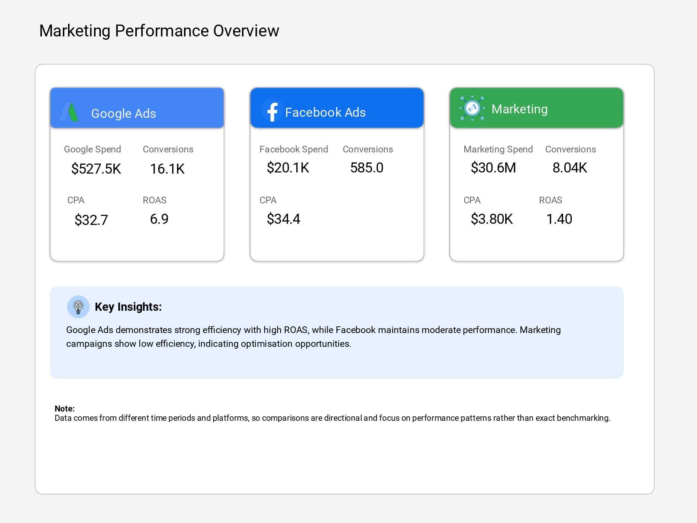
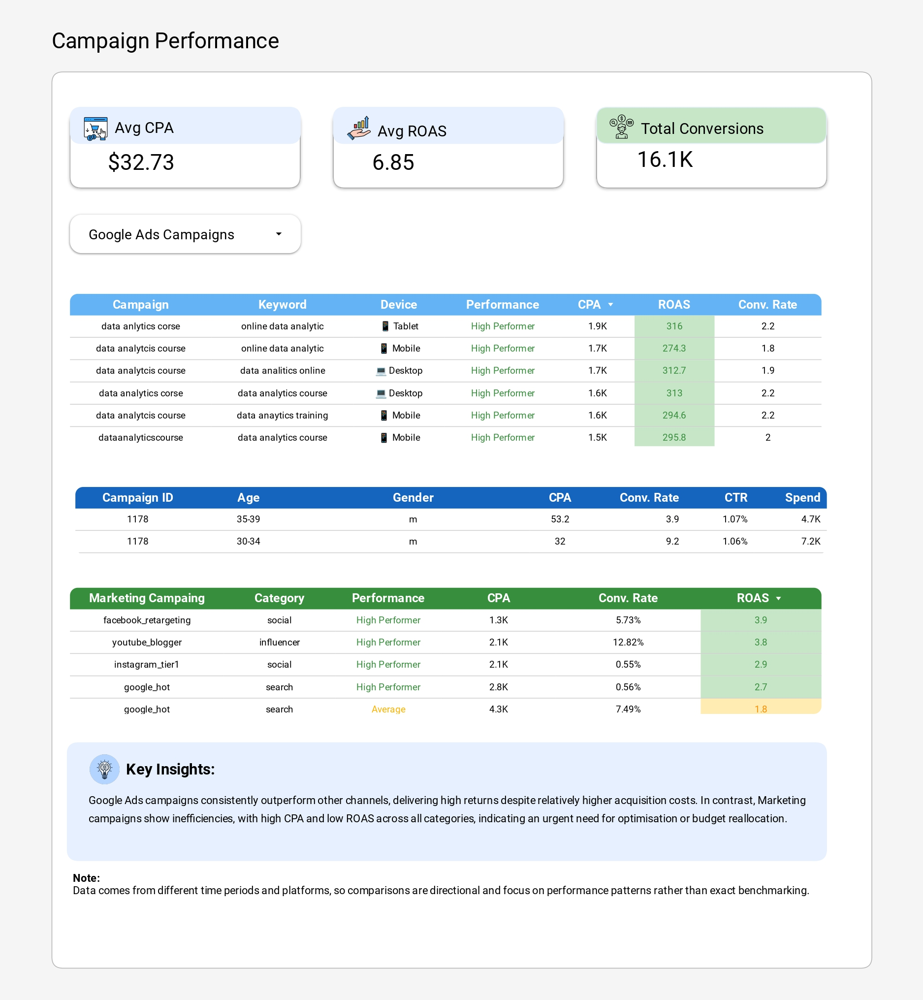
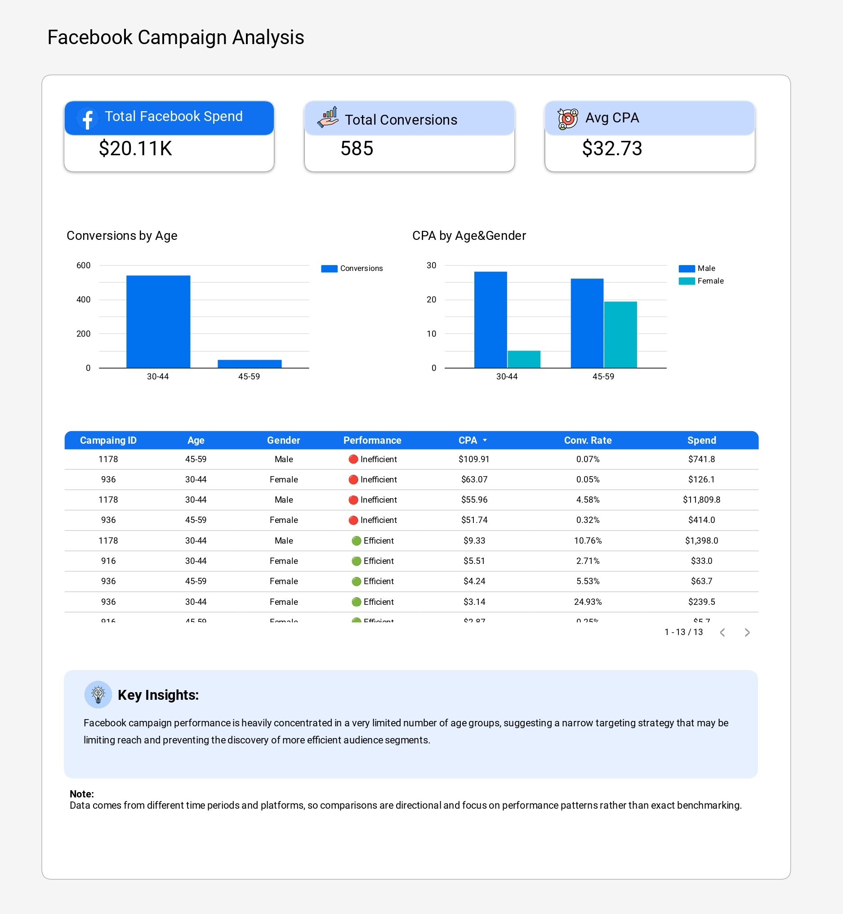
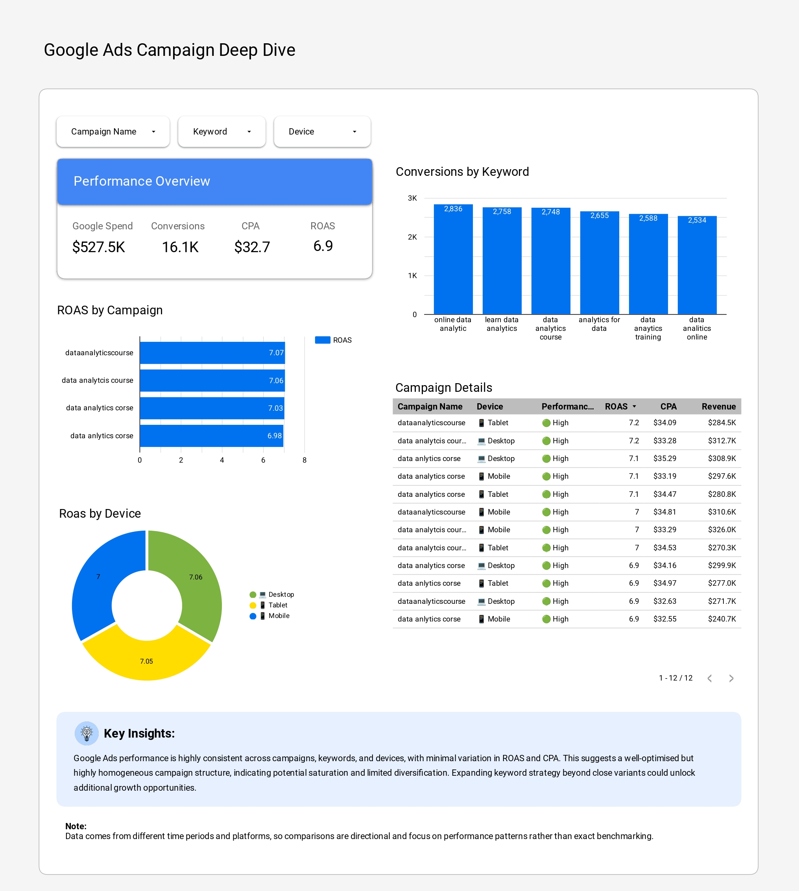
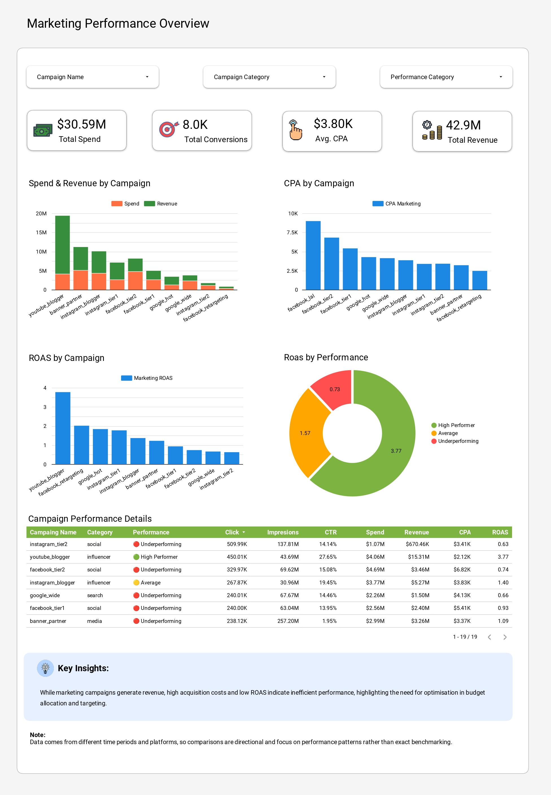

# 📊 Marketing Campaign Performance Analysis

## 🧠 Project Overview
This project analyses marketing campaign performance across multiple channels (Google Ads, Facebook Ads, and Marketing campaigns) to identify inefficiencies, improve return on investment (ROI), and provide actionable optimisation strategies. 

The project simulates a real-world scenario in which a marketing team generates revenue but lacks clarity on performance efficiency and budget allocation.

## 🎯 Project Objective
* Evaluate campaign performance across different channels.
* Identify inefficiencies in cost (CPA) and profitability (ROAS).
* Analyse audience segmentation and campaign structure.
* Provide data-driven recommendations to optimise marketing performance.

## 📂 Data Sources & Workflow

The datasets used in this project were sourced from **Kaggle** to simulate a multi-channel marketing environment:

* **Google Ads Dataset:** Contains campaign, keyword, device, and location performance data. [Source here](https://www.kaggle.com/datasets/nayakganesh007/google-ads-sales-dataset).
* **Facebook Ads Dataset:** Provides audience segmentation, including age, gender, and interest-based metrics. [Source here](https://www.kaggle.com/datasets/madislemsalu/facebook-ad-campaign).
* **Marketing Spending Dataset:** Used for overall campaign performance and ROI analysis. [Source here](https://www.kaggle.com/datasets/sinderpreet/analyze-the-marketing-spending).

### 🛠 Data Pipeline
1. **Extraction:** Downloaded raw data in CSV format from Kaggle.
2. **Cleaning (Excel):** Performed initial data auditing, handled missing values, and standardised date formats.
3. **Processing (BigQuery):** Uploaded cleaned tables to Google Cloud for SQL analysis, metric calculation (CPA, ROAS), and data modelling.
4. **Visualisation (Looker Studio):** Connected BigQuery to Looker Studio to build the final interactive dashboards.

## 🧹 Data Preparation
Before analysis, the data were standardised to ensure accuracy:
1. **Cleaning:** Fixed inconsistent text values and standardised categorical fields (device, location).
2. **Feature Engineering:** Created new fields like `age_group` and `gender_clean`.
3. **Metrics Calculation:** Derived key indicators: CTR, Conversion Rate, CPA, and ROAS.

---

## 📊 Dashboard Overview

### 🟦 Page 1 — Overview
High-level KPIs (Spend, Conversions, CPA, ROAS) and cross-channel comparison.

### 🟪 Page 2 — Channel Comparison
Performance comparison across channels and identification of top-performing sources.

### 🟩 Page 3 — Facebook Ads Analysis
Audience segmentation by age and gender to identify limited audience diversification.

### 🟨 Page 4 — Google Ads Analysis
ROAS by campaign and performance by device/keyword.

### 🟥 Page 5 — Marketing Efficiency & ROI Analysis
Spend vs Revenue comparison and funnel performance identification.

---

## 🔍 Key Insights
* **Inefficiency:** Marketing campaigns generate revenue but at high acquisition costs.
* **Consistency:** Google Ads shows strong performance driven by high-value conversions.
* **Targeting:** Facebook campaigns reveal limited audience diversification, indicating potential saturation.

## 💡 Business Recommendations
1. **Reallocate Budget:** Move funds to high-performing Google Ads channels.
2. **Improve Targeting:** Refine Facebook audience segments to reduce CPA.
3. **Scale Growth:** Expand keyword strategies to identify new opportunities.

## 📌 Author
**Diego Suaza**
*Marketing & Data Analyst*
*Open to remote opportunities*
